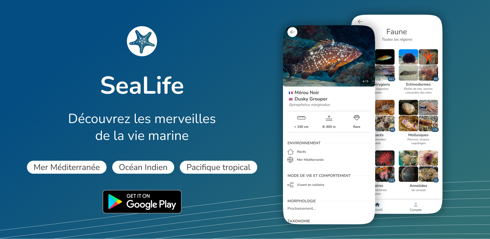

## About SeaLife

Explore the marine life of the Mediterranean, the Indian Ocean and the tropical Pacific with more than 1000 cards of common or unusual species. Each sheet includes photos taken in their natural environment and information on their behavior, morphology and habitat.

Easily search for a species using its common or scientific name. Use the filters to find a species based on its color, shape or habitat.

- [Website](https://sea-life.vercel.app/)
- [Google Play Store](https://play.google.com/store/apps/details?id=app.vercel.sea_life.twa)

---
<br>

## Table of Contents

- [Features](#features)
- [Getting Started](#getting-started)
- [Firebase emulator](#firebase-emulator)
- [Algolia](#algolia)
- [Facebook API (for fetching feed)](#facebook-api-for-fetching-feed)
- [Build and publish for Google Play Store](#build-and-publish-for-google-play-store)
- [API](#api)
- [Other commands](#other-commands)
- [Useful links](#useful-links)

## Features

### Major

- [x] Browse species by category
- [x] Search species by name
- [x] Filter species by region
- [x] Species profile (environment, behavior, taxonomy, etc.)
- [x] Google sign-in
- [ ] Contribution form (coming soon)
- [ ] Filter species by size, color, habitat, diet, etc.
- [ ] Video gallery
- [ ] Favorite list management

### Minor

- [ ] Breadcrumb when navigating between categories
- [ ] Similar species list or species of same family
- [ ] Improve text search including species family names
- [ ] Show multiple names for a species (ex: +2 next to the name)


## Getting Started

> **Prerequisites** <br>
> Node.js

```bash
# Copy env file and update it
cp .env.local.example .env.local

npm install --global yarn
yarn install
yarn dev
```

Navigate to [http://localhost:3000](http://localhost:3000)

## Firebase emulator

Firebase is used for database, authentication and functions.
For development, you can the emulator to test locally.

### Setup emulator

```bash
npm install -g firebase-tools
npx firebase login
npx firebase use sea-life-app # (optional)

# Select Authentication, Functions, Firestore
npx firebase init emulators 

# Get current extension configuration
npx firebase ext:export # (optional) 
```

### Start emulator

```bash
# Update env variable
# NEXT_PUBLIC_FIREBASE_EMULATOR=true

# Start emulator and import existing local data
npx firebase emulators:start --import ./firebase/export/

# Start emulator (only firestore for offline mode)
npx firebase emulators:start --only firestore --import ./firebase/export/

# Export existing local data
npx firebase emulators:export ./firebase/export
```

### Emulate functions & deploy

```bash
# Watch for changes
npm run build:watch --prefix functions

# Deploy functions to cloud
npx firebase deploy --only functions # (all functions)
npx firebase deploy --only functions:group-updateCountOnGroupCreate # (single function)
```

## Algolia

### Synchronize Algolia data

> **Prerequisites** <br>
> Download service account key file: https://console.firebase.google.com/u/0/project/sea-life-app/settings/serviceaccounts/adminsdk <br>
> Save it to the root of the project and rename to `sea-life-app-firebase-adminsdk.json`

```bash
npm install -g firestore-algolia-search
npx firestore-algolia-search

What is the Region? europe-west1
What is the Project Id? sea-life
What is the Algolia App Id? TIXD5TTYDU
What is the Algolia Api Key? { ALGOLIA_SEARCH_ADMIN_KEY }
What is the Algolia Index Name? species
What is the Collection Path? species
What are the Fields to extract? id,scientific_name,common_names,photos
What is the Transform Function? { empty }
What is the path to the Google Application Credential File? ./sea-life-app-firebase-adminsdk.json
```

Change extracted field in **firestore extension** :
https://console.firebase.google.com/project/sea-life-app/extensions/instances/firestore-algolia-search?tab=config

## Facebook API (for fetching feed)

- Get Facebook App info: https://developers.facebook.com/apps/518199423531488/settings/basic/
- Query: https://developers.facebook.com/tools/explorer/?method=GET&path=me%2Ffeed%3Ffields%3Dpermalink_url&version=v15.0

### Generate permanent token

1. Get user access token: https://developers.facebook.com/tools/explorer/
2. Generate long-lived token: https://developers.facebook.com/tools/debug/accesstoken/?access_token={USER_ACCESS_TOKEN}&version=v15.0
3. Get permanent access token: https://graph.facebook.com/v15.0/{USER_ID}/accounts?access_token={LONG_LIVED_ACCESS_TOKEN}

When Data Access expires, you can regain access by following the instructions:
https://developers.facebook.com/docs/facebook-login/auth-vs-data/

## Build and publish for Google Play Store

### 1. Build using Bubblewrap (recommended)

```bash
# Install bubblewrap
npm install -g @bubblewrap/cli

mkdir sea-life-android
cd sea-life-android
bubblewrap init --manifest=https://sea-life.vercel.app/manifest.json
bubblewrap build
```

#### Other ways to build:

**Using [pwabuilder.com](https://pwabuilder.com)**

- Enter the URL of the PWA (https://sea-life.vercel.app/)
- Click on "Package For Stores" and "Android"

**Using capacitor (only static pages)**

```bash
# Build
yarn build-mobile

# If you are on WSL2, you need to copy the build folder to your windows partition and open the folder with Android Studio
sudo rm -rf /mnt/c/Users/louis/OneDrive/Documents/git/sea-life/android
sudo cp -R ./android /mnt/c/Users/louis/OneDrive/Documents/git/sea-life/android

# If you are on windows, just execute the following command
npx cap sync
npx cap open android
```

### 2. Publish on Google Play Store

- Go to https://play.google.com/console/developers
- Select sea-life
- Go to "Release" > "Production" > "Create new release"
- Upload `.aab` file and fill the form

## API

### `/api/dev` (only dev env)

```bash
# Get firebase auth token (using emulator)
curl --location --request POST 'localhost:3000/api/dev/getToken?uid=sXokqYzLlTZQ6CkDRvLruttNLDhH' \
--header 'Content-Type: application/json' \
--data-raw '{
    "uid": "sXokqYzLlTZQ6CkDRvLruttNLDhH",
    "claims": {
        "admin": true
    }
}'

# Set admin claims
curl --location --request POST 'localhost:3000/api/dev/setCustomClaims' \
--header 'Authorization: Bearer <idToken>' \
--header 'Content-Type: application/json' \
--data-raw '{
    "uid": "<uid>",
    "claims": {
        "admin": true
    }
}'
```

### `/api/admin` (only admin)

```bash
# Clear algolia index
curl --location --request POST 'localhost:3000/api/admin/clearAlgolia' \
--header 'Authorization: Bearer <idToken>'
```

## Other commands

```bash
# Kill port
npx kill-port 8080

# Generate bundle report
yarn analyze
```

## Useful links

- Figma design: https://www.figma.com/file/op3TNvwVbWuf1nN5kMUtOj/SEA-LIFE?t=M7TfKsfOFSdda5tQ-0
- https://www.pwabuilder.com/reportcard?site=https://sea-life.vercel.app/
- https://manifest-gen.netlify.app/


## Contributing

See [CONTRIBUTING](./CONTRIBUTING.md) for more information.

## License

See [LICENSE](./LICENSE) for more information.